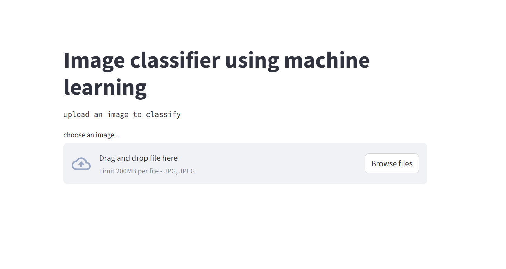

# Fruit and Vegetable Image Classification

This repository contains a machine learning model for classifying 36 different types of fruits and vegetables. The model is trained on a dataset consisting of labeled images of various fruits and vegetables. This README.md file provides an overview of the project, instructions for running the code, and details about the dataset and model.

## Dataset

The dataset used for training ,validation and testing the model consists of images of 36 different types of fruits and vegetables. Each image is labeled with the corresponding fruit or vegetable class. The dataset is split into training, validation, and testing sets to train and evaluate the model's performance.

## Model

The image classification model is built using convolutional neural networks (CNNs), a type of deep learning model commonly used for image recognition tasks. The model architecture consists of several convolutional layers followed by pooling layers for feature extraction, followed by fully connected layers for classification. The model is trained using the training data and validated using the validation data to optimize its performance.

## Usage

To use the image classification model:

1. Clone this repository to your local machine.
   ```
   git clone https://github.com/lion600/Scifor-Technology-/new/main/Mini_project2(Image_classification)
   ```

3. Download the dataset and place it inside the directory.

4. Train the model(check model_building.ipynb file)

5. Run app.py file for the final result.

6. Use the model for predicting different images which you can upload.
  
   

## Example

To classify an image of a fruit or vegetable using the trained model:



Replace `path/to/fruit_or_vegetable.jpg` with the path to the image you want to classify.


